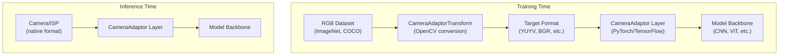
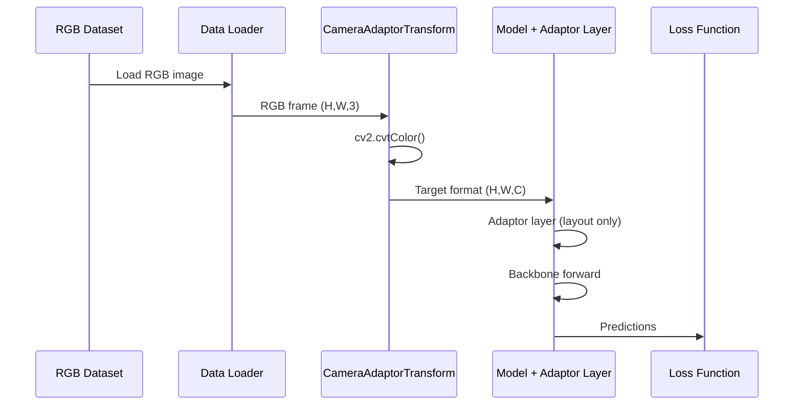
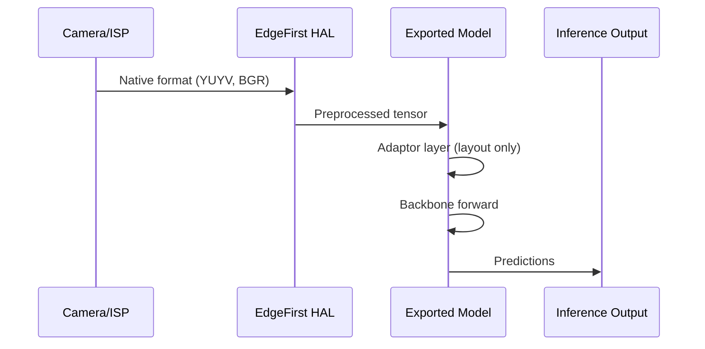

# Architecture

This document describes HOW the system works, not WHAT it does.
For features and usage, see [README.md](README.md).

## Overview

EdgeFirst CameraAdaptor enables training deep learning models that accept native camera formats directly, eliminating runtime color space conversions on edge devices.



## Components

### CameraAdaptorTransform

**Purpose**: Preprocessing transform that converts training images from source format to target camera format.

**Location**: `src/edgefirst/cameraadaptor/transform.py`

**Key Responsibilities**:
- Convert RGB/BGR training data to target format (YUYV, BGR, RGBA, etc.)
- Handle source format detection (PIL RGB vs OpenCV BGR)
- Provide NumPy array output compatible with any ML framework

**Interfaces**:
- Input: NumPy array `(H, W, C)` in source format (RGB, BGR, RGBA, BGRA)
- Output: NumPy array `(H, W, C)` in target format

**Dependencies**: OpenCV (cv2) for color conversions

### CameraAdaptor (PyTorch)

**Purpose**: Model layer that handles format-specific input processing at inference time.

**Location**: `src/edgefirst/cameraadaptor/pytorch/adaptor.py`

**Key Responsibilities**:
- Layout permutation (NHWC ↔ NCHW) when `channels_last=True`
- Alpha channel dropping for RGBA/BGRA inputs
- Ultralytics YAML integration via static methods

**Interfaces**:
- Input: PyTorch tensor `(N, C, H, W)` or `(N, H, W, C)` if `channels_last=True`
- Output: PyTorch tensor `(N, C, H, W)`

**Design Note**: Does NOT perform color conversion. Color conversion is done during training by CameraAdaptorTransform. At inference, camera provides native format directly.

### CameraAdaptor (TensorFlow)

**Purpose**: Keras layer equivalent of the PyTorch module.

**Location**: `src/edgefirst/cameraadaptor/tensorflow/adaptor.py`

**Key Responsibilities**:
- Layout permutation (NCHW → NHWC) when `channels_first=True`
- Alpha channel dropping for RGBA/BGRA inputs
- Keras serialization support (`get_config`/`from_config`)

**Interfaces**:
- Input: TensorFlow tensor `(N, H, W, C)` or `(N, C, H, W)` if `channels_first=True`
- Output: TensorFlow tensor `(N, H, W, C)`

### ColorSpace Enum

**Purpose**: Type-safe color space identifiers with channel count metadata.

**Location**: `src/edgefirst/cameraadaptor/color_spaces.py`

**Supported Formats**:
| Format | Input Channels | Output Channels | Status |
|--------|---------------|-----------------|--------|
| RGB | 3 | 3 | Supported |
| BGR | 3 | 3 | Supported |
| RGBA | 4 | 3 | Supported |
| BGRA | 4 | 3 | Supported |
| GREY | 1 | 1 | Supported |
| YUYV | 2 | 2 | Supported |
| NV12 | 1 | 3 | Roadmap |
| NV21 | 1 | 3 | Roadmap |

### CameraAdaptorConfig

**Purpose**: Configuration object for model metadata embedding.

**Location**: `src/edgefirst/cameraadaptor/config.py`

**Key Responsibilities**:
- Store adaptor configuration (format, dtype)
- Serialize to/from model metadata
- Support quantized model configurations

## Data Flow

### Training Pipeline



### Inference Pipeline



## Key Design Decisions

| Decision | Rationale | Alternatives Considered |
|----------|-----------|------------------------|
| No color conversion in model | Keeps inference fast; training has compute budget | Convert in model layer |
| Transform uses OpenCV | Industry standard, hardware-accelerated | PIL, numpy-only |
| Separate PyTorch/TensorFlow modules | Clean imports, no cross-dependencies | Single module with conditional imports |
| ColorSpace enum | Type safety, IDE autocomplete | String constants |
| channels_last/channels_first params | Handle camera pipeline direct feeds | Require user to permute |
| Source format parameter | Support OpenCV BGR loaders | Require RGB normalization |

## Package Structure

```
src/edgefirst/cameraadaptor/
├── __init__.py          # Public API exports
├── _version.py          # Version string
├── _compat.py           # Python compatibility
├── color_spaces.py      # ColorSpace enum and utilities
├── transform.py         # CameraAdaptorTransform
├── config.py            # CameraAdaptorConfig
├── hal_utils.py         # FOURCC/colorspace mapping for HAL
├── py.typed             # PEP 561 type marker
├── pytorch/
│   ├── __init__.py      # PyTorch exports
│   ├── adaptor.py       # CameraAdaptor module
│   └── lightning.py     # PyTorch Lightning integration
└── tensorflow/
    ├── __init__.py      # TensorFlow exports
    └── adaptor.py       # CameraAdaptor Keras layer
```

## Dependencies

| Dependency | Purpose | License | Required |
|------------|---------|---------|----------|
| numpy | Array operations | BSD-3-Clause | Yes |
| opencv-python | Color conversions | Apache-2.0 | Optional (transform) |
| torch | PyTorch model layer | BSD-3-Clause | Optional (torch) |
| tensorflow | TensorFlow model layer | Apache-2.0 | Optional (tensorflow) |
| pytorch-lightning | Experiment tracking | Apache-2.0 | Optional (lightning) |

## Integration Points

### Ultralytics YAML

The PyTorch CameraAdaptor supports Ultralytics YAML model definitions:

```yaml
backbone:
  - [-1, 1, CameraAdaptor, [rgba]]  # First layer
  - [-1, 1, Conv, [64, 3, 2]]
```

Static methods `compute_input_channels()` and `compute_output_channels()` enable proper channel calculation in YAML parsing.

### EdgeFirst HAL

The `hal_utils` module provides FOURCC code mapping for integration with EdgeFirst HAL runtime:

```python
from edgefirst.cameraadaptor import get_fourcc_str, from_fourcc_str

fourcc = get_fourcc_str(ColorSpace.YUYV)  # "YUYV"
color_space = from_fourcc_str("YUYV")      # ColorSpace.YUYV
```
